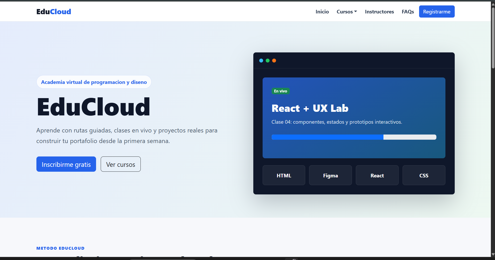

# 🎓 EduCloud

<<<<<<< HEAD
Plataforma web educativa desarrollada con React, Vite y Bootstrap.

## 📸 Vista previa

# 

Plataforma web educativa desarrollada como proyecto académico utilizando React, Vite y Bootstrap.

---

## 🚀 Tecnologías utilizadas

- React
- JavaScript (ES6+)
- Vite
- Bootstrap 5
- HTML5
- CSS3

---

## ✨ Funcionalidades

- 🏠 Página de inicio responsiva
- 📚 Catálogo de cursos
- 🎠 Carrusel interactivo
- 📋 Acordeón de preguntas frecuentes
- 🪟 Ventanas Modal
- 📱 Diseño Responsive
- ✅ Validación de formularios

---

## 📂 Estructura del proyecto

```
src/
│
├── assets/
├── components/
├── App.jsx
├── main.jsx
```

---

## ▶️ Instalación

```bash
npm install
npm run dev
```

---

## 🎯 Objetivo

Este proyecto fue desarrollado para la asignatura **Desarrollo Web Avanzado** de INACAP con el objetivo de aplicar conceptos modernos del desarrollo Frontend utilizando React.

---

## 📸 Capturas

_(Próximamente)_

---

## 👨‍💻 Autor

**Michael Oliva**

Analista Programador (INACAP)

GitHub:
https://github.com/mixeltnt

> > > > > > > c9800f43a8ab577bd39e7842cd8f116fc51b3e82
